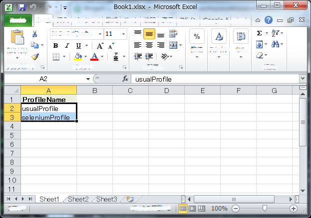
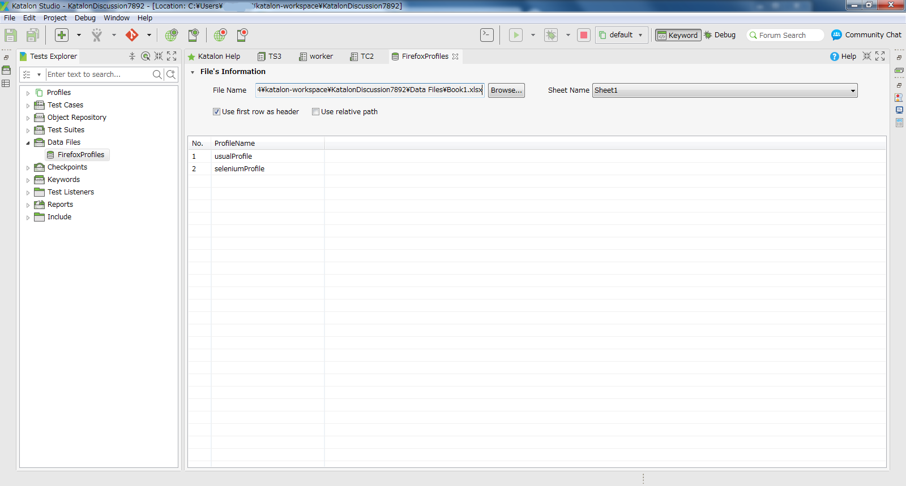
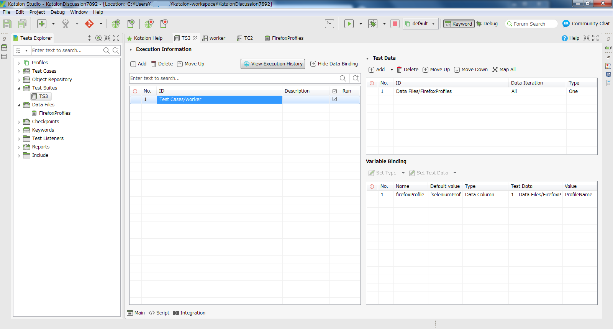

Opening Firefox with multiple user profiles
=========

## What is this?

This is a small [Katalon Studio](https://www.katalon.com/) project for demonstration purpose.
You can download the zip file from [Releases](https://github.com/kazurayam/KatalonDiscussion7892/releases) page.
You can run the demo with Katalon Studio on your PC.

This project was developed using Katalon Studio version 5.8.6.

This project was developed to propose a solution to a discussion in the Katalon User Forum:

- https://forum.katalon.com/discussion/7892/opening-firefox-with-a-specific-non-anonymous-profile

## What this demo project does

The original question raised in the discussion was as follows:

>Hi, I've noticed that Katalon is unable to firefox with a specific profile--this is a functionality built into Selenium, but because Katalon manages the opening of browsers, Selenium is unable to control that. Katalon currently doesn't have this implementation--opening firefox with a specific profile, which would be enormously beneficial for a variety of tasks (esp, for me, associating a security certificate with a profile)

In response to this issue, I added a comment where I showed how to code a test case which
start Firefox with prepared user profile and let Katalon Studio to use the Firefox for
executing Web-interaction testing.

Another question was raised, which said:
>can you tell me how would you open about 100 different profiles of Firefox from Excel, CSV or Database?

In response to this question, I mad a demo which opens Firefox with 2 different user profiles.
If I can deal with 2, then I would be able to deal with 100.

## Description

### How to start Firefox with prepared user profile

Have a look at the source of [Test Cases/TC1](Scripts\TC1\Script1531449007343.groovy)

### How to start Firefox with multiple user Profiles

I made a Excel book named `Book1.xlsx` and saved in the folder `Data Files`. It contains the following content:


I registered the Excel file into Katalon Studio. See the document [Manage Test Data](https://docs.katalon.com/katalon-studio/docs/manage-test-data.html)


We can iterate over the list of user profile names in the data file ('usualProfile', 'seleniumProfile') in two ways.

1. a Test Case iterates over the data while invoking another Test Case passing the profile name as parameter. Please find the code: [`Test Cases/TC2`](Scripts\TC2\Script1543285423118.groovy) iterates over the list of Profile names while calling another [`Test Cases/worker`](Scripts\worker\Script1543285477659.groovy)
2. a Test Suite iterates over the data while invoking another Test Case passing the profile name as parameter. The following screenshot shows how `Test Suites/TS3` is defined: 

Both approach resulted the same output in the log:
```
...
>>> opened http://demoaut.katalon.com/ in FireFox with profile named usualProfile
...
>>> opened http://demoaut.katalon.com/ in FireFox with profile named seleniumProfile
...
```


I think this log messages proves that I could start Firefox sequentially multiple times with different customer profiles recorded in Excel file.

The Katalon documentation [Data driven testing](https://docs.katalon.com/katalon-studio/tutorials/data_driven_testing.html#data-driven-tests-execution) is describing similar know-how.
